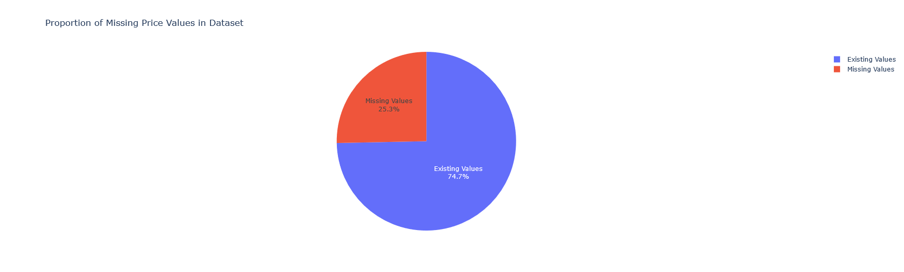
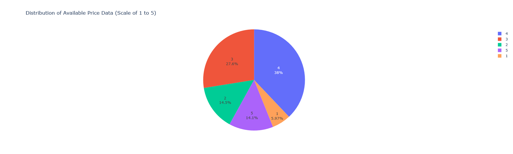
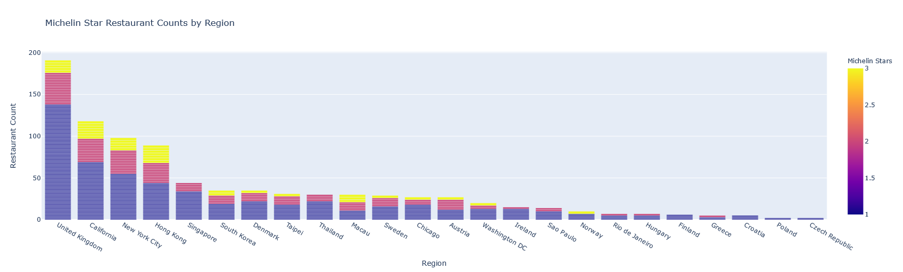
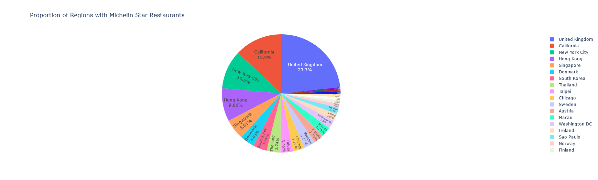
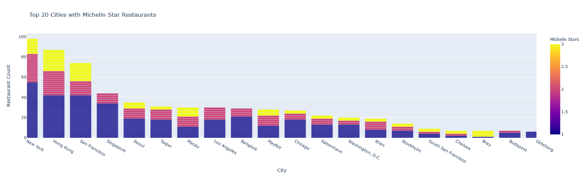
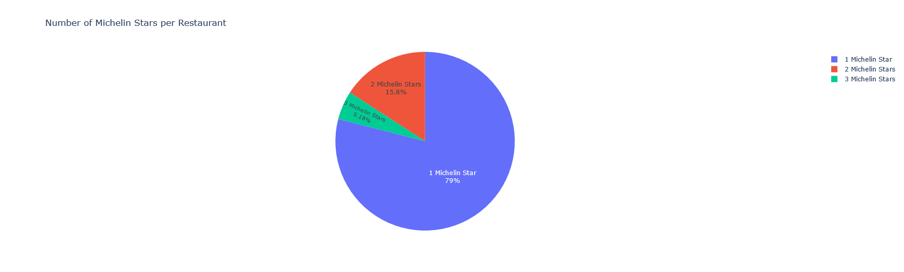
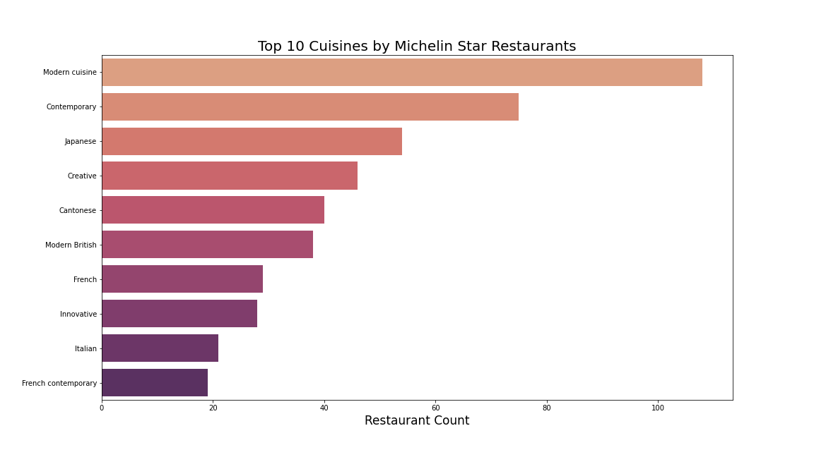
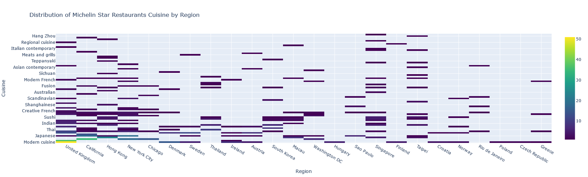
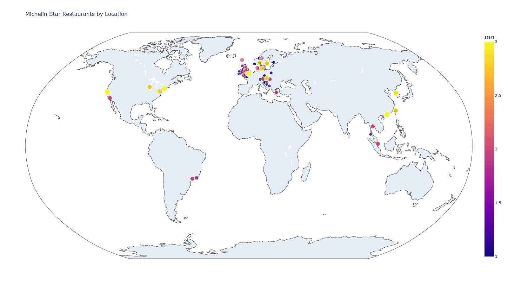

# Michelin Star Restaurants Exploratory Data Analysis


The Michelin Guides are a series of guides published by the French company Michelin.
These guides are targeted at hotels and restaurants with the intention of identifying and giving credit
to the best in their respective business. This exploratory data analysis is focused on restaurants that
have achieved Michelin Stars for the purpose of illustrating and visualizing the attributes of what
is considered the best restaurants in the world.

As seen in the image above, a restaurant awarded one Michelin Star is classified as having "High quality cooking"
and worth a stop to eat. While this metric is quite broad and vague, the Michelin Star metric aims to classify
restaurants based on how much of a time commitment is worth being dedicated to eating at this specific restaurant.
Having two Michelin Stars means the restaurnt's cooking is "excellent" and eating at the restaurant is "worth a special journey".
Finally,  a restaurant that is awarded three Michelin Stars is known as one with "exceptional cuisine" and is "worth a special journey".

NOTE: Some of the interactive visualizations below are created using plotly. Given the nature of GitHub,
these visualizations below are snapshots of their interactive counterparts. To utilize the interactive visualizations
plotly can create, download the [Jupyter Notebook](https://github.com/JamilAbbas-Hub/JamilAbbas/blob/master/Restaurant/Michelin_Star_Restaurants.ipynb)
and run locally.

## Import/Clean the Data
The three datasets are imported and concatenated into a single pandas dataframe.

```python
#Import the data
one_star_df = pd.read_csv('data/one-star-michelin-restaurants.csv')
two_star_df = pd.read_csv('data/two-stars-michelin-restaurants.csv')
three_star_df = pd.read_csv('data/three-stars-michelin-restaurants.csv')

#Add column 'stars' to note number of michelin stars each restaurant has
one_star_df['stars'] = 1
two_star_df['stars'] = 2
three_star_df['stars'] = 3


#Create main dataframe containing all restaurants and star label
frames = [one_star_df, two_star_df, three_star_df]
df = pd.concat(frames).reset_index().drop(labels='index', axis=1)
df.head(5)
```
|     | name                                                |   year |   latitude |    longitude | city                           | region         | zipCode   | cuisine               | price   | url                                                                                                                      |   stars |
|----:|:----------------------------------------------------|-------:|-----------:|-------------:|:-------------------------------|:---------------|:----------|:----------------------|:--------|:-------------------------------------------------------------------------------------------------------------------------|--------:|
|   0 | Kilian Stuba                                        |   2019 |   47.3486  |   10.1711    | Kleinwalsertal                 | Austria        | 87568     | Creative              | $$$$$   | https://guide.michelin.com/at/en/vorarlberg/kleinwalsertal/restaurant/kilian-stuba                                       |       1 |
|   1 | Pfefferschiff                                       |   2019 |   47.8379  |   13.0792    | Hallwang                       | Austria        | 5300      | Classic cuisine       | $$$$$   | https://guide.michelin.com/at/en/salzburg-region/hallwang/restaurant/pfefferschiff                                       |       1 |
|   2 | Esszimmer                                           |   2019 |   47.8068  |   13.0341    | Salzburg                       | Austria        | 5020      | Creative              | $$$$$   | https://guide.michelin.com/at/en/salzburg-region/salzburg/restaurant/esszimmer                                           |       1 |
|   3 | Carpe Diem                                          |   2019 |   47.8     |   13.0401    | Salzburg                       | Austria        | 5020      | Market cuisine        | $$$$$   | https://guide.michelin.com/at/en/salzburg-region/salzburg/restaurant/carpe-diem                                          |       1 |
|   4 | Edvard                                              |   2019 |   48.2165  |   16.3685    | Wien                           | Austria        | 1010      | Modern cuisine        | $$$$    | https://guide.michelin.com/at/en/vienna/wien/restaurant/edvard                                                           |       1 |
|   5 | Das Loft                                            |   2019 |   48.2127  |   16.3793    | Wien                           | Austria        | 1020      | Modern cuisine        | $$$$$   | https://guide.michelin.com/at/en/vienna/wien/restaurant/das-loft                                                         |       1 |


```python
print('Number of Rows: ', df.shape[0])
print('Number of Columns: ', df.shape[1])
print('Missing Values: ')
df.isnull().sum()
```


```python
Number of Rows:  695
Number of Columns:  11
Missing Values:

name           0
year           0
latitude       0
longitude      0
city           2
region         0
zipCode      194
cuisine        0
price        176
url            0
stars          0
dtype: int64

```

Next, unneeded columns will be dropped (zipCode, and url) and the price column will be changed with an integer value rather than a string of '$'.

```python
#Drop unneeded columns
df = df.drop(labels=['zipCode', 'url'], axis=1)

#Replace price data with integer of count
def split_word(word):
    return [char for char in word]

int_price = []
cat_price = df[['price']].values.tolist()

for i in cat_price:
    if i[0] is not np.nan:
        token = split_word(i[0])
        int_price.append([int(len(token))])
    else:
        #Set price = -1 if the value of price was missing
        int_price.append([int(-1)])
df[['price']] = int_price
df.head(5)
```
|    | name          |   year |   latitude |   longitude | city           | region   | cuisine         |   price |   stars |
|---:|:--------------|-------:|-----------:|------------:|:---------------|:---------|:----------------|--------:|--------:|
|  0 | Kilian Stuba  |   2019 |    47.3486 |     10.1711 | Kleinwalsertal | Austria  | Creative        |       5 |       1 |
|  1 | Pfefferschiff |   2019 |    47.8379 |     13.0792 | Hallwang       | Austria  | Classic cuisine |       5 |       1 |
|  2 | Esszimmer     |   2019 |    47.8068 |     13.0341 | Salzburg       | Austria  | Creative        |       5 |       1 |
|  3 | Carpe Diem    |   2019 |    47.8    |     13.0401 | Salzburg       | Austria  | Market cuisine  |       5 |       1 |
|  4 | Edvard        |   2019 |    48.2165 |     16.3685 | Wien           | Austria  | Modern cuisine  |       4 |       1 |

### Missing Price data
There is a significant amount of data in the 'price' column that is missing.

```python
#Work with missing price data
value = [df.price.value_counts()[-1], len(df) - df.price.value_counts()[-1]]
label = ['Missing Values', 'Existing Values']
fig6 = go.Figure(data=[go.Pie(labels=label, values=value)])
fig6.update_layout(title='Proportion of Missing Price Values in Dataset')
fig6.update_traces(textposition='inside', textinfo='percent+label')
#plotly.offline.plot(fig6, filename='fig6.html')
fig6.show()
```


We visualize the distribution of the available price data. Given that this is only an exploratory data Analysis
the missing values can stay in the price column. If this dataset were to be utilized for a model, then the
missing values would have to be taken care of.

```python
df_non_null = df[df['price']!= -1]
price = dict(df_non_null['price'].value_counts())


fig7 = px.pie(df_non_null['price'].value_counts(),
              values=df_non_null['price'].value_counts().array,
              names = [4, 3, 2,5, 1],
              title = 'Distribution of Available Price Data (Scale of 1 to 5)')
fig7.update_traces(textposition='inside', textinfo='percent+label')
#plotly.offline.plot(fig7, filename='fig7.html')
fig7.show()
```



## Exploratory Data Analysis
Restaurant count per region is visualized:
``` python
#Plot Restaurants by region
labels = {'region': 'Region', 'stars': 'Michelin Stars'}
fig = px.bar(df, x='region', y='stars', color='stars', title='Michelin Star Restaurant Counts by Region', labels=labels)
fig.update_layout(barmode='stack', xaxis={'categoryorder':'total descending'})
fig.update_yaxes(title='Restaurant Count')
plotly.offline.plot(fig, filename='fig.html')
fig.show()
```



Distribution of Michelin Star Restaurants by region:
```python
#Proportion of regions with michelin star restaurants
fig0 = px.pie(df, names='region',
              title='Proportion of Regions with Michelin Star Restaurants',
             hover_data = ['region'])
fig0.update_traces(textposition = 'inside', textinfo='percent+label')
#plotly.offline.plot(fig0, filename='fig0.html')
fig0.show()
```

  


Top 20 cities with the most Michelin Star restaurants:

```python
#Top 20 cities with the most restuarants with michelin stars
fig2 = px.bar(df, x='city', y='stars', color='stars', title='Top 20 Cities with Michelin Star Restaurants',
             labels=dict(city='City', stars='Michelin Stars'))
fig2.update_layout(barmode='stack', xaxis={'categoryorder':'total descending'})
fig2.update_yaxes(title='Restaurant Count')
fig2.update_xaxes(range = [0,19])
#plotly.offline.plot(fig2, filename='fig2.html')
fig2.show()
```

  


Distribution of number of Michelin Stars by restaurant:

```python
#Proportion of number of michelin stars in michelin star restaurants
fig1 = px.pie(df[['stars']].value_counts(),
              values=df[['stars']].value_counts().array,
              names=['1 Michelin Star', '2 Michelin Stars', '3 Michelin Stars'],
              title = 'Number of Michelin Stars per Restaurant')
fig1.update_traces(textposition='inside', textinfo='percent+label')
#plotly.offline.plot(fig1, filename='fig1.html')
fig1.show()
```
  


Most popular cuisine styles by Michelin Star restaurant count:
```python
#Restaurant count by cuisine
fig3, ax = plt.subplots(figsize=(16,9))
plt.title('Top 10 Cuisines by Michelin Star Restaurants', fontsize=20)
sns.barplot(x=df.cuisine.value_counts()[:10], y=df.cuisine.value_counts()[:10].index, palette='flare')
plt.xlabel('Restaurant Count', fontsize=17)
plt.savefig('cuisine_count.png')
```
  


Most popular cuisine style by region:
```python
#Distribution/heatmap of cuisine by region
df_C = df[['cuisine', 'region']]
x=[]
y=[]
for i in (df_C.value_counts().index.tolist()):
    x.append(i[1])
    y.append(i[0])

z = df_C.value_counts().tolist()
fig4 = go.Figure(data=go.Heatmap(dict(x=x, y=y, z=z), colorscale='viridis'))
fig4.update_layout(title='Distribution of Michelin Star Restaurants Cuisine by Region',
                  xaxis_title='Region',
                  yaxis_title='Cuisine')
#plotly.offline.plot(fig4, filename='fig4.html')
fig4.show()
```  
  


Create a wordcloud from the titles of Michelin Star Restaurants
```python
#Create wordcloud from restaurant titles  
restaurant_words = ''
stopwords = set(STOPWORDS)

for val in df.name:
    val = str(val)
    tokens = val.split()

    for i in range(len(tokens)):
        tokens[i] = tokens[i].lower()

    restaurant_words += " ".join(tokens)+" "

wordcloud = WordCloud(width=1600, height=900,
                     background_color = 'black',
                     stopwords = stopwords,
                     min_font_size=10).generate(restaurant_words)

plt.figure(figsize=(16,9))
plt.imshow(wordcloud)
plt.axis('off')
plt.title('Wordcloud of Titles of Michelin Star Restaurants', fontsize=20)
plt.savefig('wordcloud.png')
```
  


Spatial Visualization of Michelin Star restaurants by location:
```python
#Visualize restaurants on world map
fig5 = px.scatter_geo(df, lat='latitude', lon='longitude',
                     color='stars',
                     hover_data=['name','city', 'region'],
                     projection='robinson', size='stars', size_max=12, width=1600, height=900,
                     title='Michelin Star Restaurants by Location')
#plotly.offline.plot(fig5, filename='fig5.html')
fig5.show()
```
  
    
